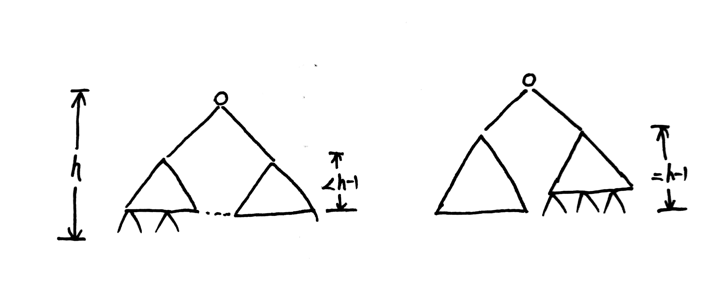

**题意：给一个完全二叉树，计算所有节点个数。**

[Definition of a complete binary tree from Wikipedia](https://en.wikipedia.org/wiki/Binary_tree#Types_of_binary_trees)

<br/>

**O(n)解TLE了，给出O((logn)^2)解法**



树的高度定义，空为-1，根节点高度为0。

这个问题可以转化为看树的子树是不是满二叉树，满二叉树的节点个数就是`2^(h+1)+1`。完全二叉树的特征，如果右子树高度是原来树高度-1，则如上图中的右图的情况，这时左子树就一定是满二叉树。如果右子树高度小于原来树高度-1，则是上图中左图的情况，这时右子树就一定是满二叉树。

```
/**
 * Definition for a binary tree node.
 * struct TreeNode {
 *     int val;
 *     TreeNode *left;
 *     TreeNode *right;
 *     TreeNode(int x) : val(x), left(NULL), right(NULL) {}
 * };
 */
class Solution {
public:
    int countNodes(TreeNode* root) {
        int h = getHeight(root);
        if(h < 0) return 0;
        int rh = getHeight(root->right);
        if(rh == h-1) return (1 << h) + countNodes(root->right);
        return (1 << h-1) + countNodes(root->left);
    }
private:
    int getHeight(TreeNode* root){
        if(root == NULL) return -1;
        return getHeight(root->left) + 1;
    }
};
```